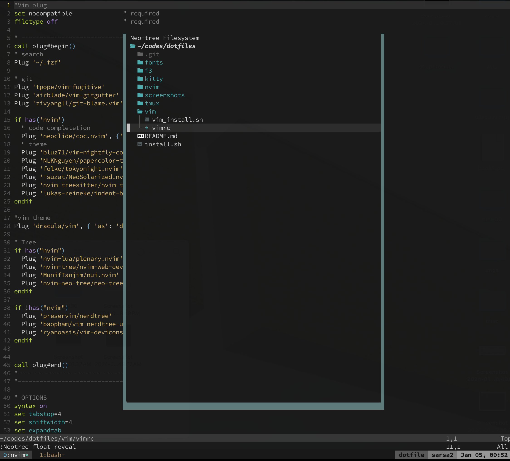

# dotfiles
- tmux:
```
bash tmux/tmux_install.sh tmux
or
bash tmux/tmux_install.sh solarized_tmux
or
bash tmux/tmux_install.sh dracula_tmux
or
bash tmux/tmux_install.sh tokyonight_tmux
```
- vim:
```
bash vim/vim_install.sh
```
- nvim:   
see [nvim readme](nvim/readme.md) for details

- fonts:
see [fonts readme](fonts/readme.md) for details

- all at once, but still need to see [nvim readme](nvim/readme.md) for details:
```
bash install.sh
```

- screenshots:

PaperColor (nvim tree)      |  Solarized (nerd tree)
:-------------------------:|:-------------------------:
  |  

