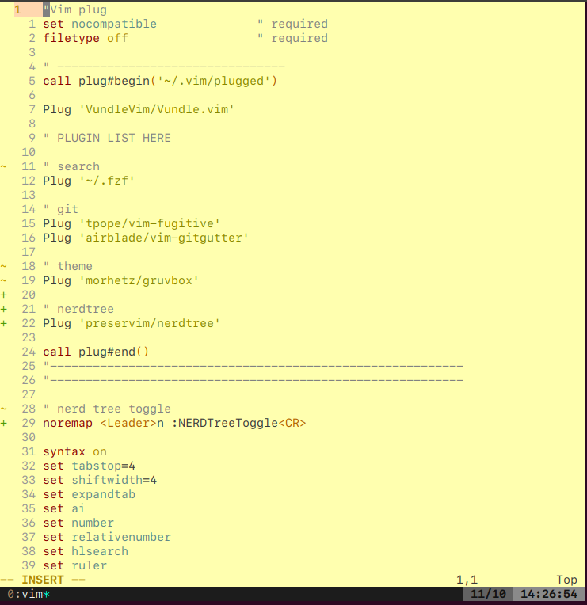

# dotfiles
Vim, tmux
## Screenshots and my preferences


This is my dotfiles setup. I use vim with nerdtree, fzf, gruvbox theme and git ones. With tmux, I use the config from geohot and also have some modifications.
## Installation
```
git clone https://github.com/trqminh/dotfiles.git
cd dotfiles
bash light_install.sh
```


